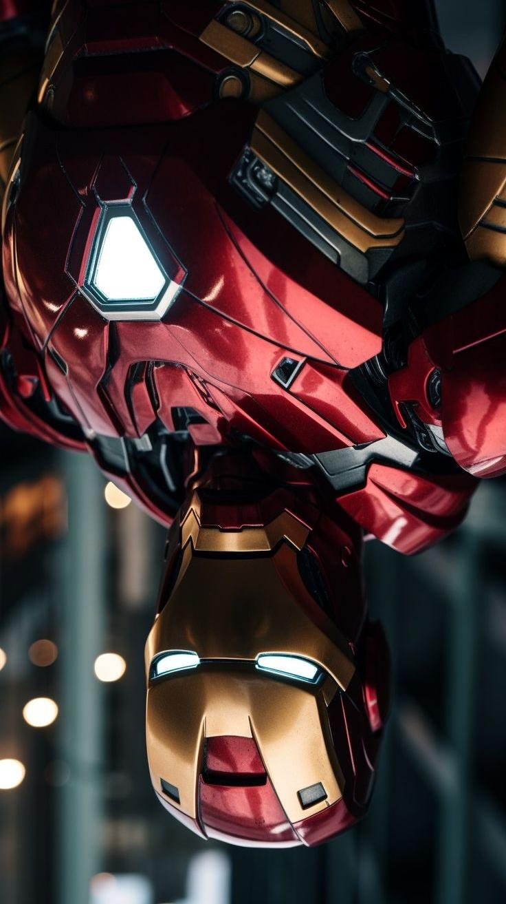

# Image-Editor
A simple Image-Editor written in JAVA.

# Structure:

- This image-editor has a command line interface. 
There is one class - ImageEditor , which contains a main function and 11 functions , namely
    - `1. Convert to GrayScale`
    - `2. Rotate 90 degrees Anti-clockwise`
    - `3. Rotate 90 degrees Clockwise`
    - `4. Adjust Brightness`
    - `5. Invert the Image Horizontaly`
    - `6. Invert the Image Verticaly`    
    - `7. Blur the Image`
    - `8. Edge Detection`
    - `9. Invert Color`
    - `10. Hulk Scale`
    - `11. Christopher Nolan Effect.`

    - `12. Exit.`
    

# Command-Line-Interface : 

- `Checking for valid commands and arguments` :

    - The program accepts png and jpeg files. It cannot take path so keep the input image in the same folder `/ImageEditor/<inputimage>.`

    

    - In order to check for valid commands, an array of commands has been created.

    

    -  The type of argument1 has to b compulsorily `.jpg` or `.jpeg` or `.png`.

    -It automatically generates and `.jpg` output file in the same folder i.e `/ImageEditor` 

    - If there is any error in the program, it prints the exception in the terminal.
    

- `Taking the input file` :

    - Used the `System.java.io` module that creates a file-object and stores a given file in the file-object.

# Functions

    Original Image

- `1. Convert to GrayScale` :

    

    - It laterally inverts the image by fetching the rgb value of each pixel, and switches the ith pixel of each row with the (n-i)th pixel of that row.

    - Used `java.awt.image.BufferedImage` module to create an object of Buffered Image and process it and return the processed Buffered Image as the output.

- `to-grayscale` :

    

    - It uses the `gray-color-space` instead of the `3-byte-color-space`. This leads to the creation of a grayscaled image.

    - Used `java.awt.image.BufferedImage` module to create an object of Buffered Image and process it and return the processed Buffered Image as the output.

    - `2. Rotate Anti Clockwise`

    

    - It rotates the image `Anti clockwise`. The function exchanges every row with the column i.e row becomes column and column becomes row. Then it inverts it horizontally.

    - Used `java.awt.image.BufferedImage` module to create an object of Buffered Image and process it and return the processed Buffered Image as the output.

- `3. Rotate Clockwise`

    

    - It rotates the image `clockwise`. The function exchanges every row with the column i.e row becomes column and column becomes row.

    - Used `java.awt.image.BufferedImage` module to create an object of Buffered Image and process it and return the processed Buffered Image as the output.

    - `4. Change brightness` :

    
    Here the Brightness is increased to 150%.

    - This function takes an input as an integer, that gives the increase or decrease percentage of brightness and it increases the r, g, b values of every pixel of the image, by the percentage entered as input. This leads to an increase in the effective brightness. (In order to avoid error which might occur if r,g or b values surpass their threshold value : 255, there is a check done using the if block, ensuring that no value goes above 255, and gets caped at 255).

    - Used `java.awt.image.BufferedImage` module to create an object of Buffered Image and process it and return the processed Buffered Image as the output.

    - `5. Invert Image Horizontaly`

    
    Here it inverts the image Horizontaly. 

    

    - It inverts the image `Horizontaly`. The function exchanges every starting column with ending column i.e it creates a new image with runing the loop from ending column index to starting column index.

    - Used `java.awt.image.BufferedImage` module to create an object of Buffered Image and process it and return the processed Buffered Image as the output.

    - `6. Invert Image Verticaly`

    
    Here it inverts the image Verticaly. 

    

    - It inverts the image `Verticaly`. 
    The function exchanges every starting row with ending row i.e it creates a new image with runing the loop from ending row index to starting row index.

    - Used `java.awt.image.BufferedImage` module to create an object of Buffered Image and process it and return the processed Buffered Image as the output.

    - `7. Blur`

    
    Here the Blurness is 20. 
     
     - It Blurs the image . The function takes the blurness value and creates a sqaure matrix of it. It then takes the average value of all red, green and blue pixels from the square matrix and stores it in the current pixel.
    

    - Used `java.awt.image.BufferedImage` module to create an object of Buffered Image and process it and return the processed Buffered Image as the output.

    - `8. Edge Detection`

    
    Here the stroke is 4. 
     
     - The code you provided is an implementation of edge detection . The algorithm takes an input image and returns an output image with the edges of the input image highlighted. The algorithm works by comparing the color of each pixel with the color of a pixel a certain distance away (determined by the strokes variable). If the difference between the two colors is above a certain threshold, then the pixel is considered to be part of an edge and is colored black in the output image. Otherwise, it is colored white.
    

    - Used `java.awt.image.BufferedImage` module to create an object of Buffered Image and process it and return the processed Buffered Image as the output.

    - `9. Color Inversion`

    
    Here the stroke is 4. 
     
     - The code you provided is an implementation of color inversion. The algorithm takes an input image and returns an output image with the colors of the input image inverted. The algorithm works by subtracting each color value from 255 (the maximum value for a color), which results in the inverse color.

    - Used `java.awt.image.BufferedImage` module to create an object of Buffered Image and process it and return the processed Buffered Image as the output.

- ` 10. Hulk Scale`

    
    
    HULK SMASH
     - The code you provided is an implementation of Hulk Scale. The algorithm takes an input image and returns an output image turned as its the hulk's world. The algorithm works by updating the rgb value to  only green, which results in the Hulk Scale.

    - Used `java.awt.image.BufferedImage` module to create an object of Buffered Image and process it and return the processed Buffered Image as the output.

    - ` 11. Nolan Scale`
      
      
       
    
      Now I become Death. Destroyer of Worlds...
    
     
     - The code you provided is an implementation of Nolan Effect. The algorithm takes an input image and returns an output image turned as its a scene from Christopher Nolan Movie. The algorithm works by updating the rgb value to  only red and green and turning off the blue value which results in the Nolan Effect.

    - Used `java.awt.image.BufferedImage` module to create an object of Buffered Image and process it and return the processed Buffered Image as the output.

    

### ~ By __Amritesh Indal__
